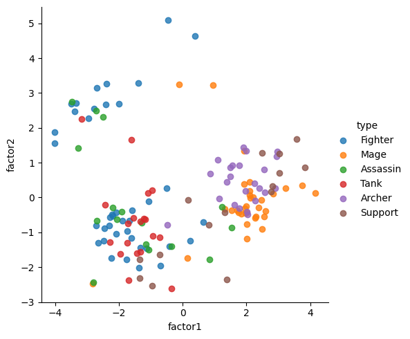

# 資料科學作品集 (Data Science Portfolio)

包含四個資料科學專案，展示了各種機器學習技術，包括分類、分群、回歸和降維。每個專案都包含詳細的說明、代碼和結果。

## 目錄

1. [分類: 客戶流失預測](#分類-客戶流失預測)
2. [分群: 國家數據分析](#分群-國家數據分析)
3. [回歸: 波士頓房價預測](#回歸-波士頓房價預測)
4. [降維: 英雄數據分析](#降維-英雄數據分析)

---

### 回歸: 波士頓房價預測

#### 專案背景與目標

這個專案的目標是使用波士頓房價資料集預測房屋的中位數價格。

#### 資料來源與前處理

- **資料集**: BostonHousing.csv
- **前處理步驟**:
  - 處理缺失值。
  - 標準化數據。

#### 資料探索性分析 (EDA)

- 使用散佈圖和直方圖可視化特徵分佈和關係。

#### 使用模型

1. **Linear Regression**
2. **Polynomial Regression**
3. **Lasso Regression**
4. **Ridge Regression**

#### 結果

| 模型                 | train R² | test R² | train RMSE | test RMSE |
|----------------------|----------|---------|------------|-----------|
| Linear Regression    | 0.7436       | 0.7134       | 4.7585     | 4.6473     |
| Polynomial Regression| 0.9307       | 0.7665       | 2.4746     | 4.1943     |
| Lasso Regression     | 0.7206       | 0.6990       | 4.9671     | 4.7626     |
| Ridge Regression     | 0.7423       | 0.7136       | 4.7700     | 4.6449     |

#### 結論與未來工作

Polynomial Regression的模型表現最好，因為他的R²最高和較好的RMSE。

#### 代碼

完整代碼請參見 `Regression` 文件夾。

---

### 分類: 客戶流失預測

#### 專案背景與目標

這個專案的目標是使用一個包含電信客戶各種特徵的資料集來預測客戶流失情況。

#### 資料來源與前處理

- **資料集**: customer_churn_data.csv
- **前處理步驟**:
  - 處理缺失值。
  - 將分類變數轉換為數值變數，使用一熱編碼（One-Hot Encoding）。

#### 資料探索性分析 (EDA)

- 使用圖表展示特徵的分佈和特徵之間的關係。
- 使用相關性熱圖理解特徵之間的關係。

#### 使用模型

1. **邏輯回歸 (Logistic Regression)**
2. **決策樹 (Decision Tree)**
3. **隨機森林 (Random Forest)**
4. **支持向量機 (SVM)**

#### 結果

| 模型       | Accuracy | Precision | Recall | Specificity |
| -------- | ------ | --------- | ------ | ----------- |
| Logistic Regression | 0.814 | 0.658 | 0.552 | 0.903 |
| Support Vector Machine (SVM) | 0.809 | 0.657 | 0.507 | 0.911 |
| Decision Tree | 0.792 | 0.451 | 0.473 | 0.806 |
| Random Forest | 0.832 | 0.594 | 0.515 | 0.881 |
| XgBoost | 0.785 | 0.586 | 0.501 | 0.884 |

#### 結論與未來工作

Random Forest 是表現最好的模型，從他的指標可看出
Accuracy (準確率):
Random Forest 的準確率是 0.832，是所有模型中最高的。
Precision (精確率):
雖然 Logistic Regression 的精確率最高 (0.658)，但 Random Forest 也達到了 0.594，在精確率上表現不錯。
Recall (召回率):
Logistic Regression 的召回率最高 (0.552)，但 Random Forest 的召回率也有 0.515，僅次於 Logistic Regression。
Specificity (特異性):
SVM 的特異性最高 (0.911)，但 Random Forest 的特異性也達到 0.881，僅次於 SVM。

#### 代碼

完整代碼請參見 `Classification` 文件夾。

---

### 降維: 英雄數據分析

#### 專案背景與目標

這個專案的目標是對英雄數據集進行降維分析，以便更好地進行可視化和分析。

#### 資料來源與前處理

- **資料集**: [hero.csv](link-to-dataset)
- **前處理步驟**:
  - 處理缺失值。
  - 標準化數據。

#### 資料探索性分析 (EDA)

- 使用散佈圖和箱形圖探索數據分佈和特徵關係。

#### 降維方法

1. **主成分分析 (PCA)**
2. **MDS**

#### 結果

**PCA**
|攻擊距離|魔力|魔力回復|魔力提升|生命提升|生命|生命回復|移動速度|物理攻擊|物理防禦|魔法防禦|
|--------|----|-------|-----|-----|---|---|---|---|---|---|
|第一主成分|0.43|0.28|0.19|0.14|-0.14|-0.32|-0.31|-0.33|-0.35|-0.34|-0.34|
|第二主成分|0.072|-0.43|-0.56|-0.5|-0.32|-0.24|-0.21|0.014|-0.021|-0.08|-0.16|

第一主成分：代表「魔力型英雄」。攻擊距離較長，魔力相關屬性較高，但其生命、物理能力及防禦相關數據較低。
第二主成分：代表「物理型英雄」。魔力相關屬性較低，但物理相關能力較高。

射手(Archer)及法師(Mage)英雄普遍具有較大的x值，代表它們符合第一主成分的特性：遠程攻擊、魔法傷害高。
鬥士(Fighter)普遍擁有較小的x值。代表它們魔力較低但擁有相關較高的物理能力。

#### 代碼

完整代碼請參見 `DimReduction` 文件夾。

---

### 分群: 國家數據分析

#### 專案背景與目標

這個專案的目標是根據各種經濟和社會指標對不同國家進行分群分析。

#### 資料來源與前處理

- **資料集**: Country-data.csv
- **前處理步驟**:
  - 處理缺失值。
  - 標準化數據。

#### 資料探索性分析 (EDA)

- 使用散佈圖、箱形圖和熱圖探索數據分佈和特徵關係。

#### 分群方法

1. **K-means 分群**
2. **層次分群 (Hierarchical Clustering)**

#### 結果

K-means 聚類的目的是將數據點分成 K 個簇，每個簇內的點之間的相似性較高，而簇與簇之間的差異較大。
HC 聚類會生成一個樹狀圖（樹狀圖），展示數據點之間的合併過程和層次結構。

#### 代碼

完整代碼請參見 `Clustering` 文件夾。

---

